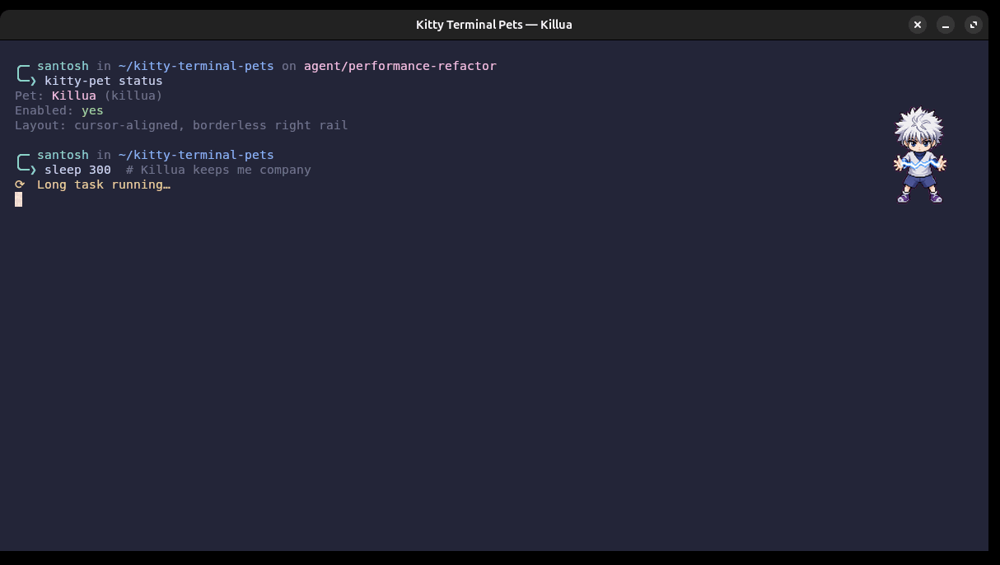

# Kitty Terminal Pets 🐈‍⬛

Animated little coworkers for the [Kitty terminal](https://sw.kovidgoyal.net/kitty/). They hang out in a slim rail on the right, follow your command line, and switch animations while commands run.

[](https://github.com/Soontosh/kitty-terminal-pets/actions/workflows/ci.yml)
[](LICENSE)
[](#requirements)

[Project page](https://soontosh.github.io/kitty-terminal-pets/) · [Setup guide](docs/SETUP.md) · [Troubleshooting](docs/TROUBLESHOOTING.md)

## See it in action

### Killua on the rice



Killua absolutely stealing the show in the setup this project was born in. This is a privacy-safe live capture of the real Kitty theme, layout, and pet renderer—not a UI mockup.

> Killua is a locally installed Petdex pet shown here for demonstration. Its character artwork and pet files are not distributed by this repository.

### Byte Cat, right out of the box


Byte Cat is the original starter pet included with every fresh install.

## The nice bits

- Reuses the pets already installed in `~/.codex/pets`—one catalog, two homes.
- Includes an original **Byte Cat** starter pet, so a fresh install is not an empty install.
- Tracks `idle → running → success/failed → idle` independently in each tab.
- Keeps the pet near the real cursor row without touching shell input.
- Uses a local Unix socket, not a Bash `DEBUG` trap or a process fighting Readline for the TTY.
- Does not trigger “python3 is still running” when the pet is the only thing left to close.
- Leaves real close warnings in place for real commands.
- Sleeps in Linux `inotify` or macOS `kqueue` while nothing changes—idle panes do no polling or Petdex rescans.

## Install

The tiny one-liner:

```bash
bash <(curl -fsSL https://raw.githubusercontent.com/Soontosh/kitty-terminal-pets/main/install.sh)
```

Prefer to look before you leap? Completely fair:

```bash
git clone https://github.com/Soontosh/kitty-terminal-pets.git
cd kitty-terminal-pets
less install.sh
./install.sh
```

Then **fully quit and reopen Kitty once**, and pick a pet:

```bash
kitty-pet select
```

That is the whole setup. The installer creates an isolated Python environment, adds one marked block to `kitty.conf`, starts a low-priority user service through systemd (Linux) or launchd (macOS), and runs its own asset test.

On macOS, the installer finds Kitty in `/Applications/kitty.app` automatically. If `~/.local/bin` is not already on your shell `PATH`, add this once so `kitty-pet` is available from new shells:

```bash
echo 'export PATH="$HOME/.local/bin:$PATH"' >> ~/.zprofile
```

## Everyday commands

| Command | What it does |
| --- | --- |
| `kitty-pet select` | Pick from the shared pet list |
| `kitty-pet select killua` | Pick directly by ID |
| `kitty-pet list` | Show every discovered pet |
| `kitty-pet timing` | Show the selected pet's exact timing |
| `kitty-pet status` | Show selection and state |
| `kitty-pet disable` | Hide/close pet rails |
| `kitty-pet enable` | Bring them back |
| `kitty-pet close` | Close managed rails right now |

Shortcuts inside Kitty:

- `Ctrl+Shift+F8` opens the pet picker.
- `Ctrl+Shift+F7` pauses or resumes pets.

## Where pets come from

The catalog checks these directories:

```text
~/.codex/pets/<pet-id>/pet.json
~/.local/share/terminal-pets/pets/<pet-id>/pet.json
```

Each pet uses the same Codex-style `pet.json` plus an 8×9 WebP sprite atlas. Sparse manifests are fine; Kitty Terminal Pets supplies Codex-compatible defaults. Petdex character files stay on your computer and are **not** bundled in this repository.

## Why this should not eat your keyboard

An early local prototype used a background `kitty @` process attached to the same TTY as the shell. That was a bad idea: two readers can steal characters from one another. This project deliberately does not do that.

The current design:

1. Kitty accepts control only on a user-local Unix socket (`socket-only`).
2. A low-priority controller reads Kitty metadata using its framed socket protocol.
3. Each pet renders in its own borderless rail.
4. No Bash traps, prompt hooks, per-keystroke code, or TTY remote control are installed.

A live stress check pushed 16,384 raw characters and 250 commands through a managed Kitty window and verified every byte and command arrived. The repository tests also cover idle detection, cursor alignment, looping animations, and repeat installs/uninstalls.

## Requirements

- Linux with systemd user services, or macOS with launchd
- Kitty 0.36 or newer (the standard `/Applications/kitty.app` install works on macOS)
- Python 3.10 or newer
- `git` for the one-line bootstrap
- A graphical Kitty session (Wayland, X11, and native macOS are supported)

Pillow is installed into the app's private virtual environment automatically.

## Customize the rail

Edit `~/.config/kitty-pet/config.json`:

```json
{
  "pane_percent": 13,
  "pet_rows": 7,
  "cursor_offset_rows": 1
}
```

- `pane_percent`: width of the right rail.
- `pet_rows`: animation height in terminal rows.
- `cursor_offset_rows`: move the pet lower (positive) or higher (negative).

The service notices changes automatically.

Performance-sensitive controls live in the same file:

```json
{
  "controller_poll_seconds": 1.0,
  "startup_delay_seconds": 0.75
}
```

The controller interval may be set from `0.25`–`10` seconds. Lower values detect state slightly sooner but do more socket work. The startup delay lets the shell finish opening before Kitty adds the pet rail. The defaults are the measured balance; see [Performance](docs/PERFORMANCE.md) before tuning them.

## Tune every little beat

Timing can be global, per state, per pet, or per frame. Changes are live—no service or Kitty restart needed.

```bash
# Make every animation 25% slower.
kitty-pet timing all all --speed 0.75

# Give Killua's working animation a relaxed 4 FPS.
kitty-pet timing killua running --fps 4

# Hold Killua's success pose for 8 seconds.
kitty-pet timing killua success --display-seconds 8

# Set the duration of all six running frames, in milliseconds.
kitty-pet timing killua running --frame-ms 100,100,140,100,100,300

# See the resolved result or remove just this override.
kitty-pet timing killua
kitty-pet timing killua running --reset
```

`speed` accepts `0.05`–`20`, FPS accepts `0.1`–`60`, individual frames accept `17`–`60000` ms, and completion poses can remain visible for up to 24 hours. Running and idle durations remain task-driven, so a cosmetic setting cannot keep the working state alive after a command finishes. See the [full timing guide](docs/TIMING.md) for precedence and direct JSON configuration.

## Uninstall

From the cloned repository:

```bash
./uninstall.sh
```

Settings and pet assets are preserved. To remove Byte Cat and the Kitty Terminal Pets settings too:

```bash
./uninstall.sh --purge
```

The uninstaller removes only the marked Kitty config block. It does not touch unrelated Kitty settings.

## More help

- [Full setup guide](docs/SETUP.md)
- [Troubleshooting](docs/TROUBLESHOOTING.md)
- [Timing customization](docs/TIMING.md)
- [Performance and benchmarks](docs/PERFORMANCE.md)
- [Security notes](SECURITY.md)
- [Contributing](CONTRIBUTING.md)

If something is weird, an issue with your OS version, Kitty version, `kitty-pet status`, and the relevant service status is wildly helpful:

```bash
# Linux
systemctl --user status kitty-pet

# macOS
launchctl print "gui/$(id -u)/io.github.soontosh.kitty-terminal-pets"
```

## License

Code and the original Byte Cat artwork are available under the [MIT License](LICENSE). Third-party pets remain subject to their own terms.
