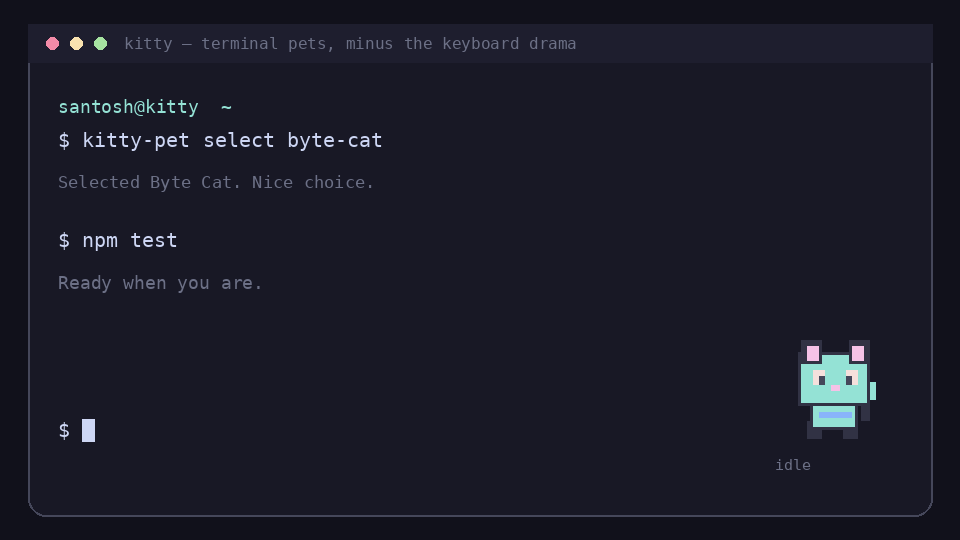

# Kitty Terminal Pets 🐈‍⬛

Animated little coworkers for the [Kitty terminal](https://sw.kovidgoyal.net/kitty/). They hang out in a slim rail on the right, follow your command line, and switch animations while commands run.



[](https://github.com/Soontosh/kitty-terminal-pets/actions/workflows/ci.yml)
[](LICENSE)
[](#requirements)

[Project page](https://soontosh.github.io/kitty-terminal-pets/) · [Setup guide](docs/SETUP.md) · [Troubleshooting](docs/TROUBLESHOOTING.md)

## The nice bits

- Reuses the pets already installed in `~/.codex/pets`—one catalog, two homes.
- Includes an original **Byte Cat** starter pet, so a fresh install is not an empty install.
- Tracks `idle → running → success/failed → idle` independently in each tab.
- Keeps the pet near the real cursor row without touching shell input.
- Uses a local Unix socket, not a Bash `DEBUG` trap or a process fighting Readline for the TTY.
- Does not trigger “python3 is still running” when the pet is the only thing left to close.
- Leaves real close warnings in place for real commands.

## Install

The tiny one-liner:

```bash
bash <(curl -fsSL https://raw.githubusercontent.com/Soontosh/kitty-terminal-pets/main/install.sh)
```

Prefer to look before you leap? Completely fair:

```bash
git clone https://github.com/Soontosh/kitty-terminal-pets.git
cd kitty-terminal-pets
less install.sh
./install.sh
```

Then **fully quit and reopen Kitty once**, and pick a pet:

```bash
kitty-pet select
```

That is the whole setup. The installer creates an isolated Python environment, adds one marked block to `kitty.conf`, starts a low-priority user service, and runs its own asset test.

## Everyday commands

| Command | What it does |
| --- | --- |
| `kitty-pet select` | Pick from the shared pet list |
| `kitty-pet select killua` | Pick directly by ID |
| `kitty-pet list` | Show every discovered pet |
| `kitty-pet status` | Show selection and state |
| `kitty-pet disable` | Hide/close pet rails |
| `kitty-pet enable` | Bring them back |
| `kitty-pet close` | Close managed rails right now |

Shortcuts inside Kitty:

- `Ctrl+Shift+F8` opens the pet picker.
- `Ctrl+Shift+F7` pauses or resumes pets.

## Where pets come from

The catalog checks these directories:

```text
~/.codex/pets/<pet-id>/pet.json
~/.local/share/terminal-pets/pets/<pet-id>/pet.json
```

Each pet uses the same Codex-style `pet.json` plus an 8×9 WebP sprite atlas. Sparse manifests are fine; Kitty Terminal Pets supplies Codex-compatible defaults. Petdex character files stay on your computer and are **not** bundled in this repository.

## Why this should not eat your keyboard

An early local prototype used a background `kitty @` process attached to the same TTY as the shell. That was a bad idea: two readers can steal characters from one another. This project deliberately does not do that.

The current design:

1. Kitty accepts control only on a user-local Unix socket (`socket-only`).
2. A low-priority controller reads Kitty metadata using its framed socket protocol.
3. Each pet renders in its own borderless rail.
4. No Bash traps, prompt hooks, per-keystroke code, or TTY remote control are installed.

A live stress check pushed 16,384 raw characters and 250 commands through a managed Kitty window and verified every byte and command arrived. The repository tests also cover idle detection, cursor alignment, looping animations, and repeat installs/uninstalls.

## Requirements

- Linux with systemd user services
- Kitty 0.36 or newer
- Python 3.10 or newer
- `git` for the one-line bootstrap
- A graphical Kitty session (Wayland and X11 are both fine)

Pillow is installed into the app's private virtual environment automatically.

## Customize the rail

Edit `~/.config/kitty-pet/config.json`:

```json
{
  "pane_percent": 13,
  "pet_rows": 7,
  "cursor_offset_rows": 1
}
```

- `pane_percent`: width of the right rail.
- `pet_rows`: animation height in terminal rows.
- `cursor_offset_rows`: move the pet lower (positive) or higher (negative).

The service notices changes automatically.

## Uninstall

From the cloned repository:

```bash
./uninstall.sh
```

Settings and pet assets are preserved. To remove Byte Cat and the Kitty Terminal Pets settings too:

```bash
./uninstall.sh --purge
```

The uninstaller removes only the marked Kitty config block. It does not touch unrelated Kitty settings.

## More help

- [Full setup guide](docs/SETUP.md)
- [Troubleshooting](docs/TROUBLESHOOTING.md)
- [Security notes](SECURITY.md)
- [Contributing](CONTRIBUTING.md)

If something is weird, an issue with `kitty --version`, `kitty-pet status`, and `systemctl --user status kitty-pet` is wildly helpful.

## License

Code and the original Byte Cat artwork are available under the [MIT License](LICENSE). Third-party pets remain subject to their own terms.
